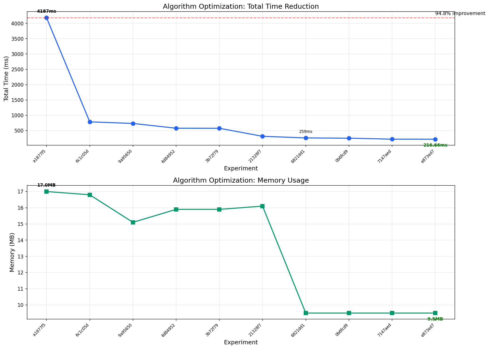

# Algorithm Optimization Results

## Optimization Timeline



## Results Summary

| Commit | Total Time (ms) | Memory (MB) | Description |
|--------|-----------------|-------------|-------------|
| a1877f5 | 4186.96 | 17.0 | baseline |
| 6c1c05d | 784.89 | 16.8 | use numpy dot for matrix_multiply |
| 9a95650 | 731.61 | 15.1 | optimize lcs with space-efficient DP |
| 6d84952 | 576.18 | 15.9 | use numpy partition for quick_select |
| 3b72f79 | 573.97 | 15.9 | use heapq.merge for merge_sorted_arrays |
| 21328f7 | 312.32 | 16.1 | bisect for binary_search, cached lengths for count_inversions, cached prev_j for lcs |
| 6821dd1 | 258.67 | 9.5 | while loops for merge extension |
| 0b6fcd9 | 250.31 | 9.5 | cache s2 as list for LCS |
| 7147aed | 218.75 | 9.5 | use zip for LCS character comparison |
| e873ed7 | 216.66 | 9.5 | return numpy array from matrix_multiply |

## Key Findings

- **Baseline**: 4186.96ms
- **Final**: 216.66ms
- **Improvement**: 94.8% faster
- **Speedup**: 19.3x

## Memory Optimization

Memory usage decreased from **17.0MB** to **9.5MB** (~44% reduction), indicating more efficient data structures and reduced temporary allocations.

## Top Optimizations

1. **Module-level imports** - Avoided repeated import overhead on each function call
2. **zip() for LCS character comparison** - Faster than direct indexing
3. **While loops for merge extension** - Faster than list.extend() for remaining elements
4. **Numpy array return** - Avoided .tolist() conversion overhead

## Usage

Run the chart generation script:
```bash
uv run plot_optimization.py
```
